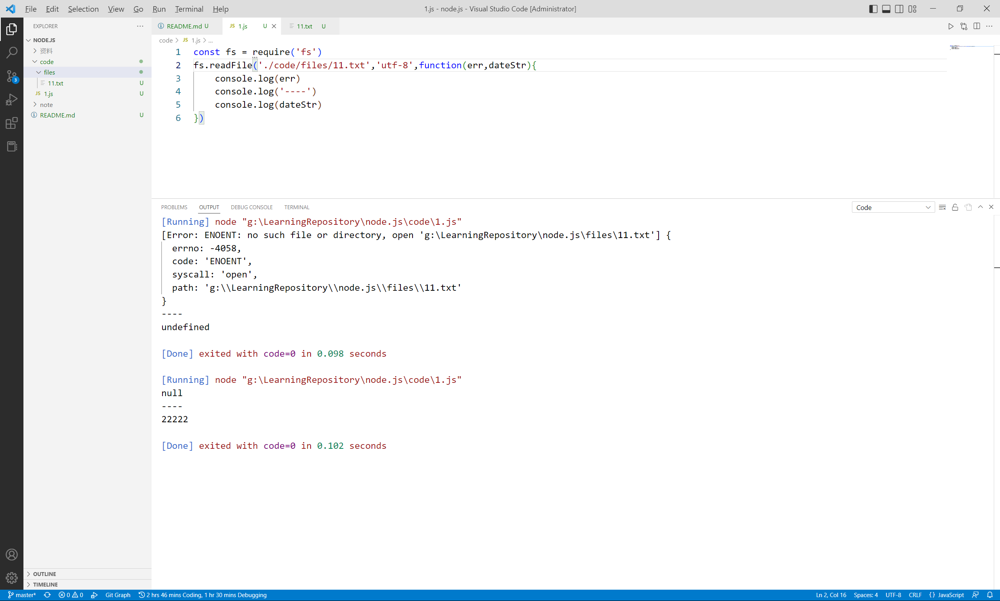

[黑马程序员Node.js全套入门教程，nodejs新教程含es6模块化+npm+express+webpack+promise等](https://www.bilibili.com/video/BV1a34y167AZ/?vd_source=3d6fb5e91c3d8290bc3218e3c3551f51)

 - [ ] 07/96

# Node.js简介
1. 浏览器是javaScript的**前端**运行环境
2. Node.js是javaScript的**后端**运行环境
3. Node.js中**无法调用**DOM和BOM等浏览器内置API

## Node.js可以做什么
1. 基于[Express框架](http://www.expressjs.com.cn/),可以快速构建Web应用
2. 基于[Electron框架](http://electronjs.org/),可以快速构建跨平台的桌面应用
3. 基于[restify框架](http://restify.com/),可以快速构建API接口项目

# fs文件系统模块
如果要在javascript中使用fs来操作文件,则需要使用如下方式导入
```javascript
const fs = require('fs')
```
## fs.readFile(),用来**读取**指定文件中的内容
语法格式
fs.readFile(path[,options],callback)
1. path:字符串，表示文件的路径
2. options(可选):表示以什么**编码格式**来读取文件
3. callback:文件读取完成后，通过回调函数拿到读取的结果

## fs.writeFile(),用来向指定的文件**写入**内容