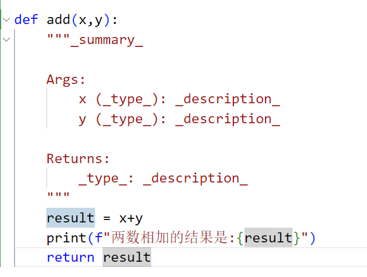

[黑马程序员python教程，8天python从入门到精通，学python看这套就够了_哔哩哔哩_bilibili](https://www.bilibili.com/video/BV1qW4y1a7fU/?vd_source=3d6fb5e91c3d8290bc3218e3c3551f51）

# 注释
```python
# 我是单行注释
```

\#与注释内容一般以一个空格隔开
```python
"""
    我是多行注释
"""
```

# 变量
**格式:** 变量名 = 变量值
```python
moeny = 50
```

# 数据类型
使用**type()**查看数据类型
```python
print(type("川月"))
```
查看的是 变量存储的***数据***的类型，因为**变量无类型**，但是他存储的数据有。

# 数据类型转换
int(x) 将x转换为一个整数  
float(x) 将x转换为一个浮点数  
str(x) 将对象x转换为一个字符串


# 标识符
ruler:  
1. 内容限定
   只允许出现:***英文***  ***中文***(不推荐)  ***数字***(不可用在开头)  ***下划线*** 
2. 大小写敏感
3. 不可以使用关键字

# 算术运算符
/   除      9 / 2 = 4.5
//  取整除  9 / 2 = 4
**  指数    2**3 = 8

# 字符串
1. 单引号定义:name = 'cy'
2. 双引号定义:name = "cy"
3. 三引号定义:name = """cy"""
```python
在字符串中包含双引号
name = '"川月"'
在字符串中包含单引号
name = "'川月'"
使用转义字符(\)
name = "\"川月\""
```

## 字符串格式化
```python
name = "川月"
message = "%sGOOD GOOD" % name
print(message)

year = 2025
salary = 20000
message = "川月%s年平均工资:%s" % (year,salary)
```
类型占位  

| 占位符 | 类型   |
| ------ | ------ |
| %s     | 字符串 |
| %d     | 整数   |
| %f     | 浮点数 |

### 浮点数数字精度控制(m.n)
m:控制宽度，要求是数字(*很少使用*)，**设置的宽度小于数字自身，不生效**
.n:控制小数点精度，要求是数字，***会进行小数的四舍五入***

## 字符串格式化-快速写法
```python
name = "什么"
set_up_year = 2003
stock_price = 33.50
print(f"我是{name},我成立于:{set_up_year}年,我今天的股价是:{stock_price}")
```
特点：  
1. 不理会类型

2. 不做精度控制  

**适合对精度没有要求的时候快速使用**

## 字符串格式化-表达式的格式化
```python
print(f"1*1的结果是:{1*1}")print("inputTest")
name = input()
print(name)
print("字符串在Python中的类型是:%s" % type('字符串'))
```

```python
print("这是提示信息")
name = input()
print(name)

name = input("这是提示信息")
print(name)
```

# if语句
```python
if 条件:
    code

if age >= 18:
    print("我成年了")# 要有四个空格缩进
```

## if-else
```python
if 条件:
    code
else:
    code
```

## if-elif-else
```python
if 条件:
    code1
elif:
    code2
elif:
    code3
else:
    所有条件都不满足
```

# while
```python
while 条件:
    code

i = 0
while i < 100:
    print(i)
    i += 1
```

# for
```python
for 临时变量 in 待处理数据集(序列类型):
    code
```
```python
name = "chuanyue"
for x in name:
    print(x)
```

## range
**range(num):**获取从0开始，到num结束的数字序列(不包含num)
**range(num1,num2):**获取从num1开始，到num2结束的数字序列(不包含num2)
**range(num1,num2,step):**获取从num1开始，到num2结束的数字序列(不包含num2)数字之间的步长,以step为准(step默认为1)
eg:range(5,10,2)    取得数据为[5,7,9]   一次加2

```python
for x in range(10):
    print(x)
```

```python
for x in range(5):
    print(x)
print(x)# 不符合规范 但实际能访问到
```


# 函数
```python
def 函数名(传入参数):
    函数体
    return 返回值
```
```python
def length(str):
    count = 0
    for i in str:
        count +=1
    print(f"字符串的长度是:{count}")
```

如果函数没有使用return返回数据，那么会有返回值吗
    ***有的***
python中有一个特殊的字面量:**None**,其类型是:<class 'NoneType'> 无返回值的函数，实际上返回了None

文档说明(当打出三个引号的时候会自动生成)
```python
def add(x,y):
    """
    result = x+y
    print(f"两数相加的结果是:{result}")
    return result
```


### 声明全局变量
global